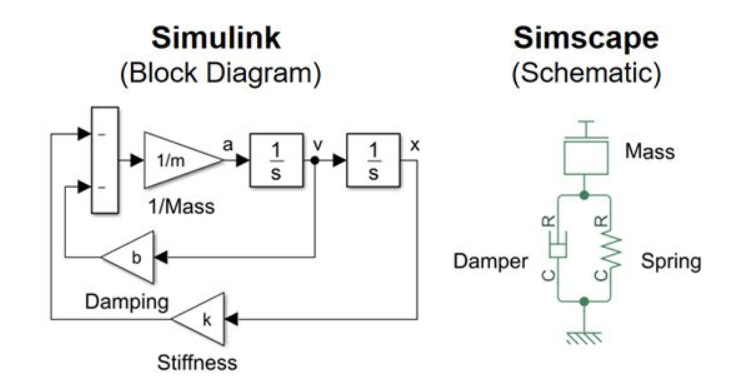
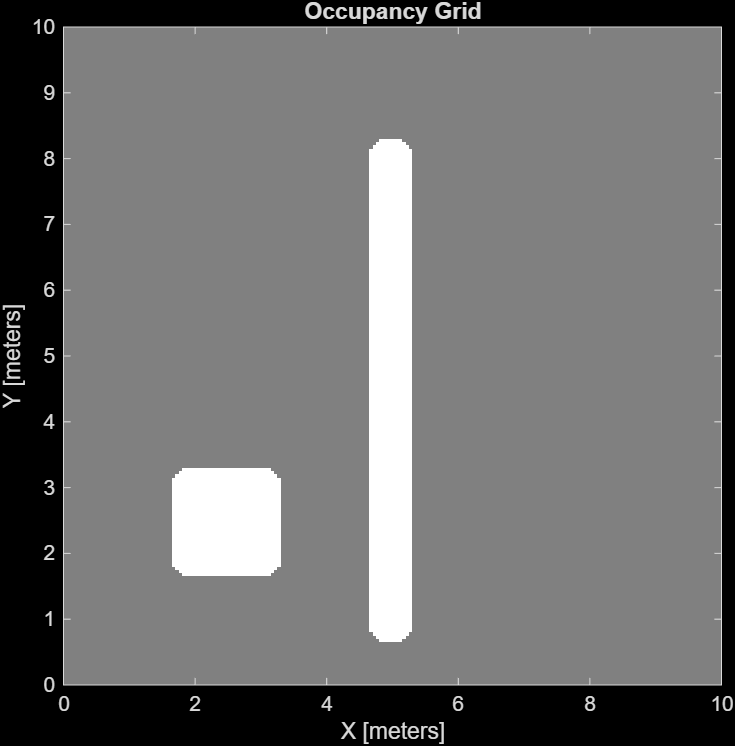
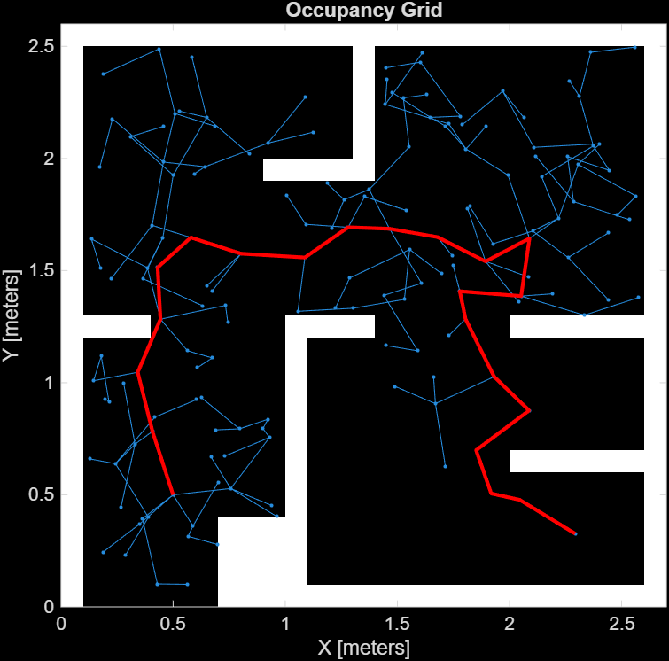
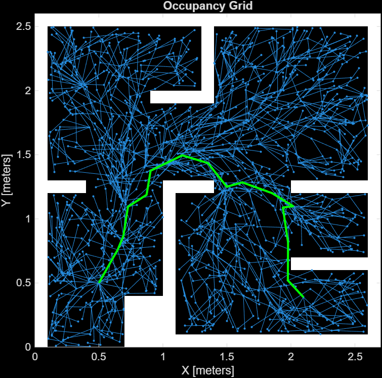

# MATLAB-Robotics
Imagine Tom Cruise gets handed a new mission. The Syndicate is on the loose, and the clock is already ticking. The mission is clear: track them down, disrupt their operation, and do it with gadgets that would make Q jealous. There's just one problem. The kind of hardware this mission demands doesn't come cheap. We're talking motor drives, sensor arrays, power systems, and precision control circuits that cost more to prototype than most people make in a year. You don't just wire those up on a breadboard and hope for the best. You have to simulate first: rigorously, completely, and with the same physics the real thing would obey. <br />
<br />
**Now the question is : how exactly can we do that?**

# Matlab - The Basics


If you've spent any time around circuit labs, embedded systems courses, or hardware prototyping benches, you've probably heard one name come up again and again: Matlab. It's got a reputation as the "engineer's calculator on steroids," and in various fields of engineering, it is used for a variety of operations and applications : from crunching raw numbers to simulating an entire physical system before a single wire gets soldered, the possibilities are endless.<br />
<br />

**So what exactly is MATLAB?**

At its core, it's a numerical computing environment and programming language built around matrices (the name literally stands for **Matrix Laboratory**). That might sound abstract, but here's the thing a: huge chunk of engineering secretly is matrices. Solving a circuit with multiple nodes, tracking how a signal evolves over time or performing calculations that would take hours by hand are only a small fraction of the tasks that MATLAB can perform.

## A Quick Look Around: The MATLAB Interface
Before we go any further, let's get oriented because opening MATLAB for the first time and staring at three panels you don't recognise is its own special kind of confusion. <br />

<br />
Here's what you're actually looking at:
* Current Folder (left , top) — this is your file browser. Whatever folder is open here is where MATLAB will look for your scripts and save your files. Keep this organised and you'll save yourself a lot of "where did that file go" moments later.
* Command Window (centre, right) — this is where MATLAB lives and breathes. You can type commands directly here and run them instantly, without writing a full script. Great for quick calculations, testing a single line of code, or just checking what a variable looks like. Think of it as your scratch pad.
* Workspace (bottom left) — every variable you create, whether by running a script or typing directly into the Command Window, shows up here. Name, type, size, value — all listed out, so you can see exactly what's in memory at any given moment. When something isn't behaving the way you expect, the Workspace is usually the first place to look.

📖Here are some resources that explain the basics of Matlab in a slightly more comprehensive manner: <br />
[▶️Matlab Crash Course - By Younes Lab](https://youtu.be/sLxdNdC6Mds?si=20N6yzAYCiUGTa-O) <br />
[▶️Complete Matlab Beginner Basics Course - By Phil Parisi](https://youtu.be/EtUCgn3T9eE?si=n-wQJrUJUJ3GnoKr)

But as you can probably tell, MATLAB by itself is mostly about writing and running code line by line. So what do we do when we want to simulate an entire system, one which evolves over time, reacts to inputs and responds like the real thing would? Simulating such a system through code would be an incredibly tedious task. Thankfully, MATLAB provides us with a solution in the form of **Simulink**.

## Simulink

Simulink is MATLAB's graphical simulation environment. Instead of writing everything as text-based code, you build your system as a block diagram : drag in a signal source, a controller, a plant model, wire them together, hit run, and watch the signals evolve on a virtual scope. It's the same underlying math as a MATLAB script, just represented visually, which turns out to be incredibly useful when a system has a lot of moving, interacting parts.

Let's see how this actually works under the hood, because "drag blocks, wire them up" is doing a lot of hand-waving right now : 
Every Simulink system, no matter how complicated it eventually gets, boils down to just two things: **blocks and lines**.
Blocks do the work : each one performs some operation, whether that's generating a signal, doing math on it, or just displaying it. 
Lines are the wires : they carry signals from one block's output straight into another block's input. 
That's genuinely it. Everything else is just more blocks and more lines, arranged in increasingly elaborate ways.

Now, blocks can generally be divided into three distinct categories and once you can spot which is which, reading any Simulink diagram gets a lot easier:

* Source blocks : these are where signals are born. They don't take any input; they just sit there generating something for the rest of the system to chew on. A Sine Wave block, a Ramp block, a Step input, all of these are sources. Think of them as the starting point of the story.
* Processing blocks : this is the middle of the story, where stuff actually happens. These blocks take an input, do something to it (add, multiply, integrate, filter, whatever the block is built for), and pass an output downstream. Most of the "logic" of your system lives here.
* Sink blocks : and finally, the end of the line, literally. Sink blocks take an input but produce no output of their own; they exist purely to show you or stop something. The Scope block (your virtual oscilloscope) is the classic example, along with the Stop Simulation block, which does exactly what it sounds like.

Source feeds into processing, processing feeds into sink  and just like that, you've got a working simulation, built entirely out of arranging these three categories in whatever order your system actually needs.

📖 A full tutorial on how to use Simulink can be found here: <br />
[▶️Getting Started With Simulink - Mathworks](https://youtube.com/playlist?list=PL484BA2AD3AE4C2D0&si=ISXrRSDpdc_2aQg6)

## Simscape
Now, within Simulink, there's a more specialized layer called Simscape. Where regular Simulink blocks represent abstract signals and math operations, Simscape blocks represent actual physical components: resistors, capacitors, motors, gears, pipes, you name it. You're not writing the differential equations that describe how these things behave; Simscape already knows the physics. You just wire the components together the way you'd wire them on a breadboard (or a schematic), and the simulation figures out the rest. 


For instance let’s look at this case: in Simulink, that's a block diagram doing the math behind springs and dampers; in Simscape, that's literally a Spring block and a Damper block, wired together the way you'd actually wire physical components on a bench. Same system, two completely different ways of representing it.

So naturally, the question becomes: what happens when you want both at once? Say you've built your physical spring-damper setup in Simscape, but you want to feed its output into a Simulink controller, or plot i.t on a regular Simulink scope. Can you just... wire them together? <br />
WELL, not quite and here's why. Simulink blocks talk to each other using mathematical signals: plain numbers flowing along directional lines, one block's output becoming the next block's input. Simscape components, on the other hand, talk to each other through physical connections, think actual current flowing through a wire, or actual force transmitted through a mechanical joint, where the connection itself doesn't have a single "direction" the way a signal does. These two worlds speak fundamentally different languages, and you can't just slap a wire between them and expect MATLAB to figure out what you meant.

This is where converter blocks come in, they're the translators sitting at the border between these two worlds, and you'll need one any time a signal needs to cross from one side to the other: <br />
* PS Converter (Simulink-to-Simscape) — takes a regular Simulink signal and converts it into a physical signal that Simscape components can actually use as an input.

* SP Converter (Simscape-to-Simulink) — does the reverse, taking a physical signal from a Simscape component and converting it back into a plain Simulink signal you can feed into a scope, a controller, or any other ordinary block.
<br />

<br />
Once you've got these two converters in your toolkit, mixing the two worlds stops being a problem. You can build the physical part of your system in Simscape, where it genuinely belongs, and still hook it straight into all the controllers, scopes, and logic you're used to building in plain Simulink.
<br />

📖 Here's another tutorial on how to use Simscape: <br />
[▶️Physical Modeling in Matlab - Mathworks](https://youtube.com/playlist?list=PLn8PRpmsu08qZutTT-7dRthkAnFuQjCOV&si=JY9XuIw65GtuIJ5F)

## Toolboxes
Okay, so at this point you've got a decent picture of how MATLAB, Simulink, and Simscape fit together : one's for writing code, one's for visual block-diagram simulation, and one's for modeling actual physical components. But there's still a piece of the puzzle we haven't really unpacked: what makes MATLAB capable of doing any of this specialized stuff in the first place? <br />
The answer is toolboxes and to be honest, this is probably the single most important concept to understand about how MATLAB actually works in practice.
Base MATLAB, on its own, gives you a solid general-purpose numerical computing environment: matrices, basic plotting, a programming language to tie it all together. Useful, but generic. Toolboxes are what take that generic foundation and bolt on deep, domain-specific functionality for whatever field you're working in without you having to implement any of it yourself.<br />
Toolboxes hand you pre-built functions, blocks, and components, all ready to drop into your project the moment you need them, no reinventing required.

---
So, with that out of the way, let's actually put this to use. We're going to walk through how to simulate various gadgets and robots in MATLAB, piece by piece.
Now, since every robot eventually needs to be powered, sensed, and controlled before it's allowed to move an inch, that's exactly where we'll start: the electronics part.


# The Electronics Part: Simscape Electrical and Friends

Strip away the motors, the joints, the fancy kinematics and every robot is ultimately just a circuit that happens to be shaped like a robot. Power has to get from a battery to a motor. A sensor has to convert something physical (flex, pressure, light) into a voltage your microcontroller can actually read. None of the mechanical stuff works until the electrical stuff works first. So that's where we're starting.

## Simscape Electrical

This is the big one for electronics simulation in MATLAB. Remember what we said about Simscape knowing the physics so you don't have to? Simscape Electrical is that same idea, applied specifically to electrical and electronic systems.

It gives you a library of any and all electrical components that you can think of :resistors, capacitors, inductors, diodes, MOSFETs, op-amps, transformers, motor drives, batteries etc. which you can wire together exactly the way you'd wire them on a schematic. No writing out differential equations, no manually deriving how a MOSFET switches, the toolbox already has all of that baked in. You just place the components, connect them, and simulate. <br />


What makes it genuinely useful for robotics specifically? A few things:

* **Motor and drive simulation** — Simscape Electrical has dedicated blocks for DC motors, BLDC motors, stepper motors, and the drive circuits that control them. You can model the full electrical behaviour of a motor: back-EMF, winding resistance, inductance and watch how it responds to a PWM signal before you've touched a motor driver IC. For anyone who's ever burned out an L298N because they didn't fully understand what was happening electrically, this is the part that would have saved you.

* **Power electronics** — H-bridges, buck converters, boost converters, PWM generators, all available as blocks. If your robot runs on a battery and needs regulated voltages at different levels (say, 12V for motors and 5V for logic), you can model the entire power chain and verify it before ordering a single component.

* **Sensor front-ends** — flex sensors, current sensors, voltage dividers, op-amp signal conditioning circuits, these are all just passive and active component arrangements, and Simscape Electrical handles all of them. You can model exactly what voltage range you'll get out of a sensor under different conditions, which saves a lot of "why is my ADC reading garbage" debugging later.

📖 *Go further with Simscape Electrical:*
- [▶️ What is Simscape Electrical – MathWorks YouTube](https://youtu.be/W6H71Fb0MTc?si=1PTjoHhZsaKPhzAE)
- [▶️ Introduction to Electrical System Modeling – MathWorks](https://youtu.be/AMnzljjkbB4?si=ckmZWc8bDDHrw59E)
- [📄 Simscape Electrical Documentation](https://www.mathworks.com/help/sps/)

---

#### Let's See It in Practice: A DC Motor Circuit

📖 *Some resources on motor modelling:*
- [▶️ DC Motor Control with Simulink – Donghwa Ryu](https://youtu.be/ArSDxzfLSxo?si=XKFLJxw-sSKdVt8c)
- [📄 DC Motor Model – MathWorks Documentation](https://www.mathworks.com/help/sps/ref/dcmotor.html)

---

## DAQ Toolbox — Bringing Real Hardware Into the Picture

Here's where simulation meets reality. You've modelled your motor circuit in Simscape Electrical but at some point, you need to actually run this on hardware and verify that the real world agrees with what your simulation predicted. That's where the **Data Acquisition Toolbox** comes in.

DAQ Toolbox lets MATLAB talk directly to physical hardware : DAQ boards, Arduinos, sensors and pull live measurements straight into your workspace. No manually exporting CSVs from an oscilloscope, no transcribing numbers off a screen. You plug in, run a few lines, and the data is in a MATLAB variable ready to be plotted or compared against your simulation output.

For a robotics project this matters enormously. You can log your motor's actual current draw during operation, compare it against what Simscape Electrical predicted, and immediately spot if something in your real circuit isn't matching the model, maybe a component value is off, or there's something in the physical system you haven't accounted for.

```matlab
% Connect to a DAQ device and capture live motor current
d = daq("ni");                         % initialise DAQ session
addinput(d, "Dev1", "ai0", "Voltage"); % current sensor output on channel 0

d.Rate = 5000;                         % 5000 samples/sec — fast enough for motor dynamics

disp('Capturing 3 seconds of motor current data...');
data = read(d, seconds(3));

% Plot and compare against simulation
plot(data.Time, data.Dev1_ai0);
xlabel('Time (s)');
ylabel('Measured Current (A)');
title('Real Motor Current vs Time');
grid on;
```


*🔧 Try it yourself — if you don't have a DAQ board, MATLAB's Arduino support package lets you do a version of this with a regular Arduino Uno over USB. Install it via the Add-On Explorer and try logging a potentiometer voltage first before moving to anything motor-related.*

📖 *Go further with DAQ Toolbox:*
- [▶️ What is DAQ Toolbox – MathWorks YouTube](https://youtu.be/oUQ4JtxZL8Q?si=r7XYnMQVJtvllqzi)
- [📄 DAQ Toolbox Documentation](https://www.mathworks.com/help/daq/)
- [📄 MATLAB Arduino Support Package](https://www.mathworks.com/hardware-support/arduino-matlab.html)

---

### How These Two Work Together

Here's the part worth pausing on, because it's pretty easy to miss when you're learning each toolbox separately.

Simscape Electrical and DAQ Toolbox aren't two separate tools you pick between, they're basically two halves of the same workflow:

- **Simscape Electrical** lets you model and simulate the circuit before anything exists physically : catch problems on screen before they become problems on a bench
- **DAQ Toolbox** lets you validate that simulation against real hardware once you've built it : confirm that the real world actually agrees with what your model predicted

Model first, measure after, compare both. That loop is how real electronics engineering actually works and having both layers inside the same MATLAB environment, sharing the same variables, the same plots, the same workspace is what makes it genuinely practical rather than just theoretically nice.


With the electronics side covered, it's time to move up a level, from the circuits that power the robot, to how the robot actually moves through the physical world. Ethan's arm can be wired up perfectly, motor drives sorted, sensors reading clean values, and it still won't reach across the table and grab the briefcase unless something tells it exactly how far to rotate, and something else makes sure it stops rotating exactly where it's supposed to. That's the part we're covering next.
 
# The Mechanical Part: Simscape Multibody, Kinematics and Control
 
## Simscape Multibody
 
Just like Simscape Electrical had a dedicated library for resistors, capacitors and motors, there's a version of Simscape built specifically for mechanical systems: Simscape Multibody. Same underlying idea. Instead of writing out equations of motion by hand for every link and joint in your robot, you place blocks that represent real rigid bodies, connect them, and the solver handles the physics: mass, inertia, gravity, contact, all of it.
 
And since Simscape Multibody lives inside Simulink, the same rule from the electronics section applies here too. Simulink blocks talk to each other using plain signals, numbers flowing along a line, but Simscape Multibody components talk through actual physical connections, like a shaft transmitting torque or a joint transmitting force. So the moment you want a regular Simulink controller (say, a PID block) to drive a Simscape Multibody joint, you're back to needing a PS Converter to turn that controller's output into something the mechanical side understands, and an SP Converter if you want to feed a joint's position back into a Simulink scope. Same translators, just doing their job on the mechanical side of the house now.
 
You also don't have to build every link from scratch inside Simulink. If you've already got a CAD assembly of your robot arm, `smimport` will pull the whole thing in directly, joints, frames, mass properties and all, ready to simulate.
 
```matlab
% Import an existing CAD assembly (exported as XML from SolidWorks, Inventor, etc.)
smimport('robotArmAssembly.xml');
```
 
Once it's running, the Mechanics Explorer gives you an actual 3D render of the mechanism moving, which is a lot more satisfying to watch than a Scope block twitching.
 
## Frames and Joints
 
Two ideas carry this entire toolbox, and once they click, the rest is just repetition.
 
A **frame** is a coordinate system attached to a specific point on a body. Every rigid body carries one, and frames are how two bodies actually get connected. Saying "attach this arm to that base" really just means lining up a frame on the arm with a frame on the base.
 
A **joint** sits between two frames and decides what motion is allowed between them. A revolute joint lets one frame rotate relative to the other, like an elbow. A prismatic joint lets one frame slide, like a linear actuator. Lock every joint and you've built a statue instead of a robot. Every degree of freedom your arm has exists purely because a joint is sitting there permitting it.
 
```matlab
% A minimal two-link arm
link1 = rigidBody('link1');
link2 = rigidBody('link2');
 
jnt1 = rigidBodyJoint('joint1', 'revolute');
jnt2 = rigidBodyJoint('joint2', 'revolute');
 
link1.Joint = jnt1;
link2.Joint = jnt2;
```
 
## Forward and Inverse Kinematics
 
Once you've got a chain of joints and frames, two questions come up constantly, and they're opposites of each other.
 
**Forward Kinematics (FK)**: if every joint angle is known, where does the end of the arm end up in space? This one's the easy direction. Walk down the chain, apply each joint's rotation and each link's length one after another, and you land on the final position and orientation.
 
```matlab
robot = importrobot('robotArm.urdf');
config = homeConfiguration(robot);
config(1).JointPosition = deg2rad(30);
config(2).JointPosition = deg2rad(45);
 
tform = getTransform(robot, config, 'endEffector');
disp(tform)   % 4x4 transform: position + orientation of the end effector
```
 
**Inverse Kinematics (IK)** runs the same question in reverse, and it's the one that actually matters when you're planning a move: the end effector needs to land on a specific point, so what joint angles get it there? Unlike FK, this usually doesn't have a single clean answer. Multiple joint configurations can reach the same point, and sometimes none can if the point's out of reach entirely. So instead of a direct formula, MATLAB solves it as an optimization problem.
 
```matlab
ik = inverseKinematics('RigidBodyTree', robot);
weights = [1 1 1 1 1 1];
initialGuess = homeConfiguration(robot);
 
targetPose = trvec2tform([0.4 0.2 0.3]);
 
[configSol, solInfo] = ik('endEffector', targetPose, weights, initialGuess);
```
 
FK tells you where you are. IK tells you how to get where you need to be. Every move the arm ever makes, reaching for a keycard, aligning a scanner, is really IK being solved over and over, several times a second.
 
## Control Theory: PID
 
Knowing the target joint angles is only half the job. Actually getting a motor to sit there, and stay there even when something nudges it off, is a separate problem, and this is where the Control System Toolbox comes in.
 
The standard tool is the **PID controller**, three terms doing three different jobs:
 
- **Proportional (P)**: reacts to how far off you are right now. Bigger error, bigger push.
- **Integral (I)**: reacts to how long you've been off. Even a small error that refuses to go away gets added up over time until the controller finally pushes hard enough to kill it. This is what removes the steady error P alone can never quite fix.
- **Derivative (D)**: reacts to how fast the error is changing, and dampens the response so the arm doesn't overshoot and wobble around the target instead of settling on it.
```matlab
Kp = 2.5; Ki = 1.2; Kd = 0.3;
C = pid(Kp, Ki, Kd);
 
plantModel = tf(1, [1 3 2]);   % motor + load, as an example
closedLoop = feedback(C * plantModel, 1);
 
step(closedLoop)
```
 
One thing worth knowing before it bites you: **integral windup**. If the error stays large too long, say the arm's physically jammed against something, the integral term keeps piling up way past what's actually needed. The moment the obstruction clears, that pent up integral term slams the motor past the target before it settles. **Anti-windup** just caps how much the integral term is allowed to accumulate, so the controller doesn't overreact once things free up. Not something you want discovering itself mid mission.
 
## PID Tuner: Letting MATLAB Do the Guesswork
 
Manually guessing Kp, Ki and Kd, then re-running the simulation each time, gets old fast. MATLAB has an app for exactly this: the **PID Tuner**.
 
```matlab
pidTuner(plantModel, C)
```
 
This opens an interactive window with the step response plotted live, plus sliders for response speed and how aggressively the transient gets handled. Drag a slider, and MATLAB recalculates all three gains in real time, updating the response curve instantly. Land on a response you're happy with, and the app hands back the tuned gains, ready to drop straight into your PID block, whether it's sitting in a plain Simulink loop or driving a joint inside Simscape Multibody.
 
It won't replace actually understanding what each term does (you still need that to judge whether the tuner's suggestion even makes sense), but it turns an afternoon of trial and error into a couple of minutes of dragging sliders.
 
---
 
The arm can now figure out where it needs to go, and get there without overshooting or jamming up. But knowing where to point a camera and actually recognizing what's in front of it are two very different problems, and Ethan still needs to lift a face off someone before this mission's anywhere close to done.


# Image Processing in MATLAB


Now during the mission Tom Cruise needs to copy someone's face. How will he be able to do that? You remember watching these scenes as he takes out a machine to scan the needed face and prepares a highly accurate-looking mask for him. This is all possible due to the concept of image processing.

So to properly understand what is happening in the world of images in MATLAB, let's first look at how our computer perceives an image, and some very basic functions which will come in handy throughout our image processing journey.

## How Computers See Images

You probably know about pixels — the tiny dots on your display screen. Mathematically, these are numerical values that combine to form a digital image.

For example:

```
20   25   18
30  255   44
60   90   77
```

This represents a tiny image where each number denotes the brightness of the pixel. The higher the number, the brighter the pixel.

This is the format in which modern smartphone photographs, CCTV footage, satellite imagery, and other visual media are stored.

One more key thing to know is **Bit Depth**. For an 8-bit image, 255 is the brightest and 0 is the blackest pixel.

## Basic MATLAB Image Functions

After this, let's see some MATLAB action using what we know about images, and see how we display, read, and get to know about the image. Here are the essential functions you must know:

### `imread()`
Reads an image from your computer into MATLAB memory as a matrix.
```matlab
img = imread('cars.png');
```

### `imshow()`
Displays the image on your screen.

### `size()`
Returns the dimensions of an image.
```matlab
size(img)
% Output: 384   512     3
```
This means the image has 384 rows, 512 columns, and 3 color channels (RGB).

### `whos`
Displays detailed information about your variables in the workspace.

### `imfinfo()`
Displays the metadata of an image file.

### `rgb2gray()`
Converts a color image to grayscale.

### `impixelinfo()`
Provides a tool to display pixel values interactively when hovering over an image.

### Extracting Specific Pixel Colors
You can find the RGB values of a specific pixel using matrix coordinates, just your 2D coordinates.
```matlab
img(120,150,:)
% Output: 255, 140, 60
```
The pixel at row 120 and column 150 has Red = 255, Green = 140, and Blue = 60.

> I would highly suggest booting up MATLAB and trying the above commands with a picture of your choice.
<br />


*I have taken the above image as a reference. It's a grayscale image, named `cars.png`.*
<br />
 <br />
 <br />
 <br />

Now, after you have tried all the commands with an image of your choice, let's see the types of images and the formats in which they are stored in MATLAB.

## Image Types & Storage

There are three primary ways images are stored:

- **Grayscale Images**: Contains only intensity (brightness) information.
- **RGB Images**: Most standard photographs are color images. Instead of storing one value per pixel, an RGB image stores three values (Red, Green, and Blue). MATLAB stores RGB images as a 3D matrix.
- **Binary Images**: Sometimes we only care whether a pixel belongs to an object or the background. We use 0 for background and 1 for object.

### Common MATLAB Data Types

| Data Type | Range | Typical Use |
|---|---|---|
| `uint8` | 0 – 255 | Most standard images |
| `uint16` | 0 – 65535 | Medical and scientific imaging |
| `double` | 0 – 1 | Image processing algorithms |
| `single` | Floating-point | Deep learning & heavy calculations |
| `logical` | 0 or 1 | Binary images |

You can always use MATLAB functions to convert between these formats and save memory:
```matlab
gray = rgb2gray(img);
bw = imbinarize(gray);
imgDouble = im2double(img);
imgUint8 = im2uint8(imgDouble);
```

After knowing how images are stored and converted, the very next step is to know about colors. We're all familiar with RGB and grayscale, but what are some other ways we can represent color in an image?

## Color Spaces

Identifying a specific shade (like the yellow shine of a car) can be tough in standard RGB. This is where the **HSV** color space comes in.

- **H (Hue)**: The actual color.
- **S (Saturation)**: How vivid or pure the color is.
- **V (Value)**: The brightness.

HSV separates color from brightness. As a result, it might not look appealing to us, but for a machine, this is easier to understand.

```matlab
hsvImage = rgb2hsv(img);
imshow(hsvImage);

H = hsvImage(:,:,1);
S = hsvImage(:,:,2);
V = hsvImage(:,:,3);
```

Other common color spaces include LAB, YCbCr, and Grayscale. I'd advise you go through these on your own, as each has its own benefits, and depending on the situation, you can prefer the right one.

**Try this yourself:**
```matlab
img = imread('urphoto.png');
gray = rgb2gray(img);
hsv = rgb2hsv(img);
lab = rgb2lab(img);
ycbcr = rgb2ycbcr(img);

figure
subplot(2,2,1), imshow(img), title('RGB')
subplot(2,2,2), imshow(gray), title('Grayscale')
subplot(2,2,3), imshow(hsv), title('HSV')
subplot(2,2,4), imshow(ycbcr), title('YCbCr')
```
<br />
 <br />

Following all the color corrections, we must also ensure that our camera is working properly. Sometimes when we put a camera in a machine, it tends to distort the image. Around the edges of the camera lens, the incoming light gets deviated, making the image look wider or thinner than it should be. <br />
 <br />

But MATLAB has you covered for this.

## Lens Calibration

This is where the **Camera Calibrator App** in MATLAB comes in handy. For this, we need multiple images of a checkerboard from different angles.

### Why Use a Checkerboard?
The most common calibration method uses a checkerboard pattern because it has precisely known edges and corners that algorithms can detect automatically.

### The Calibration Process
1. Capture multiple checkerboard images. <br />
 <br />
2. Import the images into the Camera Calibrator app.
3. Detect checkerboard corners automatically.
4. Estimate camera parameters.
5. Review the reprojection error.
6. Export the calibrated camera parameters to MATLAB.

```matlab
% Detect Checkerboard Corners
[imagePoints, boardSize] = detectCheckerboardPoints(imageFiles);

% Estimate Camera Parameters
cameraParams = estimateCameraParameters(imagePoints, worldPoints);

% Remove Lens Distortion
img = imread('road.jpg');
corrected = undistortImage(img, cameraParams);

% Display comparison
figure
imshowpair(img, corrected, 'montage')
title('Original vs Undistorted')
```
<br />
 <br />

*This image is what we get when we directly use the lens calibration app. You can use the code and you'll get the same result. Since we have an app, we can simplify things — in this case, you have to pull the red bar down for image 5, as it's an outlier, and upload some more images. This is how you calibrate a camera.*

Closely following this, the next step is to understand how images can be processed. So let's go through the image processing pipeline.

## Image Processing Pipeline

Image processing can be described as the set of processes aimed at enhancing an image before analyzing it. It would be good if you could learn about the various features of the image, such as sharpness, contrast, and dark spots, as all these features can be modified using MATLAB.

**Captured Image → Image Preprocessing → Feature Extraction → Object Detection → Decision Making**

Following are some image processing functions:

MATLAB provides the `imadjust()` function to modify image brightness and contrast. Make sure you first convert your image to grayscale using MATLAB's `rgb2gray()` function.

```matlab
img = imread('cameraman.tif');
adjusted = imadjust(img);
imshowpair(img, adjusted, 'montage')
```
<br />
 <br />

A **histogram** is one of the most useful tools in image processing. Instead of showing where pixels are located, a histogram shows how many pixels have each intensity value.

```matlab
gray = rgb2gray(imread('peppers.png'));
figure
imhist(gray)
```
<br />
 <br />
 <br />

Sometimes an image occupies only a small portion of the available intensity range (making it look washed out). **Histogram equalization** redistributes pixel values to span a wider range, increasing contrast.

```matlab
% Global Equalization
equalized = histeq(gray);
imshowpair(gray, equalized, 'montage')

% Adaptive Histogram Equalization (CLAHE)
% Processes small regions independently, great for uneven lighting.
enhanced = adapthisteq(gray);
imshowpair(gray, enhanced, 'montage')
```
<br />
 <br />

As you can see in the above image, the difference is quite clear, and hence image processing is very important.

### Filtering & Sharpening

**Gaussian Filter (Smoothing)**: Blurs the image to remove noise. The second argument specifies the standard deviation (larger values = stronger smoothing). You should try finding a not-so-processed image and using this.
```matlab
filtered = imgaussfilt(gray, 2);
```

**Median Filter**: Replaces each pixel with the median value of its neighborhood — great for removing "salt and pepper" noise.
```matlab
filtered = medfilt2(gray);
```

**Sharpening**: Enhances edges and fine details if an image appears slightly blurred.
```matlab
sharp = imsharpen(gray);
```

Another very crucial next step is to look at how we segment images — how we distinguish between different things and label them in images.

## Image Segmentation

Humans can immediately look at an image and distinguish objects (e.g., coins, a table, shadows) without conscious effort. A computer only sees a matrix of values:

```
125 126 128 130 ...
132 140 145 150 ...
```

To determine which pixels belong to an object and which belong to the background, we use **Image Segmentation**. It divides an image into meaningful regions based on Intensity, Color, Texture, Shape, or Distance.

### 1. Thresholding
The simplest technique. Choose a threshold value `T`. Every pixel is evaluated as above or below that value, giving you a binary (0 or 1) image.
```matlab
gray = rgb2gray(imread('scenery.png'));
bw = imbinarize(gray);
imshow(bw)
```
<br />
 <br />

### 2. Otsu's Method
Sometimes we can't manually decide on a threshold. Otsu's method calculates it automatically based on intensity distributions.
```matlab
gray = rgb2gray(imread('scenery.png'));
T = graythresh(gray);
bw = imbinarize(gray, T);
```
<br />
 <br />

### 3. Adaptive Thresholding
Global thresholding assumes lighting is uniform. In practice (like scanning a document under a lamp), it rarely is.
```matlab
bw = imbinarize(gray, 'adaptive');
imshow(bw)
```
<br />
 <br />

### 4. Color-Based Segmentation
Sometimes brightness isn't enough. We can convert the image to HSV and threshold just the Hue channel.
```matlab
img = imread('peppers.png');
hsv = rgb2hsv(img);
H = hsv(:,:,1);
mask = H > 0.95 | H < 0.05; % Selecting a specific color range
imshow(mask)
```
<br />
 <br />

### 5. Advanced Techniques
- **Region Growing**: Starts with seed points and adds neighboring pixels with similar properties to the same region.
- **K-Means Clustering**: An unsupervised learning algorithm that groups pixels into K clusters based on similarity.
```matlab
img = imread('peppers.png');
L = imsegkmeans(img, 3);
imshow(label2rgb(L))
```
<br />
 <br />

> **Tip:** MATLAB includes an interactive **Image Segmenter App** that supports Thresholding, Graph Cut, K-Means, Active Contours, and Watershed segmentation. It even auto-generates the MATLAB code for you!

## Feature Extraction

Now we are able to barely detect things using the above methods, but if we want to check whether an image contains a particular object, such as a car or a boat, how will we be able to do that? Here comes the feature extraction portion of MATLAB.

Algorithms don't memorize every pixel; they search for interesting, distinctive regions called **features**. Good features are always:

- **Distinctive**: They stand out.
- **Repeatable**: They can be detected under different lighting or angles.
- **Robust**: They remain recognizable despite scaling, rotation, or noise.

Following are some of the ways of feature extraction.

### Edge Detection
An edge is a location where image intensity changes abruptly.
```matlab
img = rgb2gray(imread('scenery.jpg'));
edges = edge(img, 'Canny');
imshow(edges)
```
<br />
 <br />

### Corner Detection
While edges define boundaries, corners uniquely identify locations (where intensity changes significantly in multiple directions).
```matlab
img = rgb2gray(imread('checkerboard.png'));
corners = detectHarrisFeatures(img);

imshow(img)
hold on
plot(corners)
```
<br />
 <br />

### FAST Features
FAST (Features from Accelerated Segment Test) is a modern, high-speed corner detector, perfect for real-time applications like drones and robotics.
```matlab
points = detectFASTFeatures(img);
```

### Blob Detection & SURF Features
Not all important structures are corners; some are circular regions (blobs).

SURF (Speeded-Up Robust Features) detects interesting points and computes a descriptor for each point. SURF is scale-invariant, rotation-invariant, and robust to lighting changes.
```matlab
points = detectSURFFeatures(img);

imshow(img)
hold on
plot(points)
```
<br />
 <br />
 <br />

Now that we know how to see and find features in an image, the next step is to extract these features and use matching descriptors for them.

### Extracting & Matching Descriptors
Once we find features, we can extract their numerical descriptors to match them between different images (e.g., matching two photos of the same building taken from different angles).
```matlab
% Extract
points = detectSURFFeatures(img);
[features, validPoints] = extractFeatures(img, points);

% Match
[indexPairs, matchMetric] = matchFeatures(features1, features2);

% Visualize Matches
showMatchedFeatures(img1, img2, matchedPoints1, matchedPoints2)
```
<br />
 <br />
 <br />
 <br />

However, if we take stock images, we might not find an accurate match. To really try this, I suggest you click photos from your phone of an object from different perspectives and see the magic unfold yourself.

The result will display lines connecting the corresponding features across both images!

## Object Detection: Teaching Computers to Recognize Objects

Even after all the processing we have covered so far — enhancing images, segmenting objects, and extracting features — the computer still does not know what it is looking at. It may know that an object exists at a particular location, but it cannot yet determine whether that object is a person, a bicycle, a dog, or a traffic cone.

This is where **Object Detection** comes in.

Unlike image classification, which predicts only the contents of an entire image, object detection identifies both **where** the object is and **what** it is.

### Image Classification vs. Object Detection
These two concepts are often confused. Suppose we show a computer an image of a street containing two cars, one bicycle, and three pedestrians.

**Image Classification**
The computer evaluates the whole image and might simply respond:
> "This image contains vehicles and people."

It provides a single label for the entire image but does not identify or locate individual objects.

**Object Detection**
Object detection evaluates the image and returns specific locations and labels:

| Object Class | Location |
|---|---|
| Car | Bounding Box 1 |
| Car | Bounding Box 2 |
| Bicycle | Bounding Box 3 |
| Pedestrian | Bounding Box 4 |
| Pedestrian | Bounding Box 5 |
| Pedestrian | Bounding Box 6 |

Now the computer knows exactly where each object is and what it represents.

## Traditional Object Detection Methods

Before deep learning became the standard, object detection relied on carefully designed algorithms that extracted "handcrafted" features. Although these methods have largely been replaced in complex applications, they remain important because they are computationally efficient and help explain the evolution of computer vision.

The two most influential traditional approaches are **Viola–Jones** and **HOG + SVM**.

### 1. Viola–Jones Object Detection
The Viola–Jones algorithm was one of the first practical, real-time object detection methods. It became famous for face detection and was widely used in early digital cameras.

Instead of examining every pixel individually, Viola–Jones searches for simple intensity patterns called **Haar-like features**. These features measure differences between adjacent dark and bright regions.

For example, a pattern might look for a dark region above a bright region:
```
[ ████ Dark ████ ]
[ ░░░ Bright ░░░ ]
```

Such patterns capture characteristics like the darker eye region relative to the brighter cheeks on a human face. The algorithm combines thousands of these simple features using a cascade classifier to quickly determine if a face is present.

Let's try this:
```matlab
% Initialize the detector
faceDetector = vision.CascadeObjectDetector();

% Read the image
img = imread('visionteam.jpg');

% Detect faces (returns bounding boxes)
bbox = step(faceDetector, img);

% Draw rectangles around detected faces
detected = insertObjectAnnotation(img, 'rectangle', bbox, 'Face');

% Display the result
imshow(detected)
```
<br />
 <br />

### 2. Histogram of Oriented Gradients (HOG) + SVM
Rather than using simple intensity differences like Viola-Jones, HOG describes the shape of an object by analyzing the direction (orientation) of its edges.

Imagine looking at a pedestrian. Instead of remembering every pixel, HOG records information such as:
- Vertical edges
- Horizontal edges
- Diagonal edges

These edge orientations collectively form a numerical descriptor that characterizes the object's physical appearance. HOG is particularly effective for detecting objects with well-defined shapes, like humans.

**Support Vector Machine (SVM):**
HOG alone cannot recognize an object; it only extracts the features. The extracted HOG features must be passed to a machine learning classifier known as a Support Vector Machine (SVM). The SVM learns to separate different object categories (e.g., "Person" vs. "Not a Person") using examples collected during training.

```matlab
% Extract and visualize HOG features
[hog, visualization] = extractHOGFeatures(img);

figure
imshow(img)
hold on
plot(visualization)
```
<br />
 <br />

Finally, if you don't know coding, you can use the MATLAB **Image Labeler** tool. It's relatively easy to use — it's an app you can use to draw labels around images. Check out the MATLAB help section for this app.

# NAVIGATION

**Robotics System Toolbox** handles the robot's body — kinematics, manipulators, mobile robot models. **Navigation Toolbox** handles the robot's brain: where it is, what its environment looks like, and how to move through that environment. In fact, Robotics System Toolbox leans on it directly — you can design customizable motion planners by leveraging Navigation Toolbox.

This section covers planning a path, modeling sensors, doing SLAM, and planning in 3D. .

## 1. Build a Map: `occupancyMap`

Before Ethan goes anywhere, Luther pulls up the schematics. The occupancy map is that schematic — a grid where each cell holds a probability that it's occupied by an obstacle. Values close to 1 represent a high probability that the cell contains an obstacle, while values close to 0 represent a high probability that the cell is free.

```matlab
% Create an empty 10m x 10m map at 20 cells/meter
map = occupancyMap(10,10,20);

% Mark a wall and a block of obstacles using world coordinates
wallX = 5*ones(1,40);
wallY = linspace(1,8,40);
setOccupancy(map,[wallX' wallY'],1)

[blockX,blockY] = meshgrid(2:0.2:3,2:0.2:3);
setOccupancy(map,[blockX(:) blockY(:)],1)

% Inflate obstacles to add a safety buffer around them (e.g. robot radius)
inflate(map,0.3)

show(map)
```



`setOccupancy` marks specific world coordinates as occupied (1) or free (0), and `inflate` grows every occupied cell outward by a given radius. This is how we bake in clearance for the robot's physical size before planning a path through the map. 

## 2. Plan a Path: `plannerRRT`

Now Ethan needs a way through the building. Once you have a map, the toolbox provides customizable search and sampling-based path planners, as well as metrics for validating and comparing paths. The classic example is RRT (Rapidly-exploring Random Tree). The workflow is always: define a state space → define a state validator tied to your map → create the planner → call `plan`.

```matlab
% Load an example map
load exampleMaps
map = occupancyMap(simpleMap,10);

% Define an SE(2) state space [x y theta] and tie it to the map
ss = stateSpaceSE2;
ss.StateBounds = [map.XWorldLimits; map.YWorldLimits; [-pi pi]];

% Validate states against the occupancy map
sv = validatorOccupancyMap(ss,Map=map);
sv.ValidationDistance = 0.01;

% Create the RRT planner
planner = plannerRRT(ss,sv,MaxConnectionDistance=0.3);

start = [0.5 0.5 0];
goal  = [2.5 0.2 0];

[pathObj,solnInfo] = plan(planner,start,goal);

show(map)
hold on
plot(solnInfo.TreeData(:,1),solnInfo.TreeData(:,2),'.-')   % tree expansion
plot(pathObj.States(:,1),pathObj.States(:,2),'r-','LineWidth',2)  % final path
```



Swap `plannerRRT` for `plannerRRTStar` if you want the planner to keep optimizing the path after first reaching the goal — useful when path *quality*, not just feasibility, matters.

```matlab
% Same map, state space, and validator as above

starPlanner = plannerRRTStar(ss,sv, ...
    MaxConnectionDistance=0.3, ...
    MaxIterations=2000, ...            % don't stop after a quick first hit
    ContinueAfterGoalReached=true, ... % keep refining once the goal is found
    MaxNumTreeNodes=2000);

[optimalPath,optimalInfo] = plan(starPlanner,start,goal);

show(map)
hold on
plot(optimalInfo.TreeData(:,1),optimalInfo.TreeData(:,2),'.-')
plot(optimalPath.States(:,1),optimalPath.States(:,2),'g-','LineWidth',2)
```


The first `plannerRRT` snippet stops the moment it finds *any* valid path. This `plannerRRTStar` version keeps sampling and rewiring the tree for up to 2,000 iterations, even after the goal is reached, so the final path tends to be shorter and smoother instead of just "first thing that worked."

## 3. Simulate a Sensor: `imuSensor`

Even the best agent doesn't get a clean read on their own position for free. Real robots don't get clean position and orientation for free either — they infer it from noisy sensors. The toolbox lets you simulate that: you can model and tune parameters for IMU sensors, including accelerometer, gyroscope, and magnetometer characteristics, and configure noise profiles, biases, and drift to match real hardware.

```matlab
Fs = 100;  % sample rate, Hz

% Default IMU model: ideal accelerometer + gyroscope
IMU = imuSensor('accel-gyro','SampleRate',Fs);

trueAcceleration    = [1 0 0];
trueAngularVelocity = [1 0 0];

[accelReadings,gyroReadings] = IMU(trueAcceleration,trueAngularVelocity);

% Now make it realistic: add a constant gyroscope bias
IMU.Gyroscope.ConstantBias = [0.4 0 0];   % rad/s
[~,biasedGyroReadings] = IMU(trueAcceleration,trueAngularVelocity);
```

This is the same pattern used to test localization algorithms before they ever touch real hardware — generate synthetic noisy data, then run your fusion filter against it.

IMU alone only gives you relative motion, which drifts over time. Pair it with `gpsSensor` to model the other half of a typical GPS/INS setup — an absolute, if noisier, position fix:

```matlab
fs = 1;                          % 1 Hz update rate
refLoc = [42.2825 -71.343 53.0352];   % reference lat/lon/alt

gps = gpsSensor('SampleRate',fs,'ReferenceLocation',refLoc);

truePosition = [1 0 0];   % local NED position
trueVelocity = [1 0 0];

[lla,velocity,groundspeed,course] = gps(truePosition,trueVelocity);
```

Fusing the two — IMU for short-term smoothness, GPS for long-term correction — is exactly the kind of inertial navigation system the toolbox is built to simulate and tune before deployment.

## 4. SLAM: `lidarSLAM`

Sometimes the team walks into a building with no schematic at all. The toolbox provides algorithms and analysis tools for simultaneous localization and mapping (SLAM), letting a robot build a map of an unknown environment while simultaneously tracking its own position in it. `lidarSLAM` takes lidar scans, attaches them to a node in a pose graph, and automatically detects loop closures to correct drift.

```matlab
maxLidarRange = 8;     % meters
mapResolution = 20;    % cells per meter

slamAlg = lidarSLAM(mapResolution,maxLidarRange);
slamAlg.LoopClosureThreshold = 360;
slamAlg.LoopClosureSearchRadius = 8;

% In a real application "scans" comes from your robot's lidar driver.
% Here we build a small cell array of lidarScan objects from raw
% ranges/angles, the same shape your sensor data would arrive in:
angles = deg2rad(-90:1:90);   % a 180-degree sweep
numScans = 5;
scans = cell(numScans,1);
for i = 1:numScans
    ranges = 5 + 0.1*i + 0.05*randn(size(angles));  % synthetic noisy ranges
    scans{i} = lidarScan(ranges,angles);
end

% Feed each scan into the SLAM object
for i = 1:numel(scans)
    addScan(slamAlg,scans{i});
end

show(slamAlg)   % view the built map + pose graph

% Convert the SLAM result into a standard occupancy map
[scansSLAM,poses] = scansAndPoses(slamAlg);
occMap = buildMap(scansSLAM,poses,mapResolution,maxLidarRange);
show(occMap)
```

`lidarScan(ranges,angles)` is what turns raw sensor readings into the object `addScan` expects. On real hardware, `ranges` and `angles` come straight from your lidar driver (or a ROS `LaserScan` message); the loop above just stands in for that data source so the snippet runs end-to-end.

## 5. Going 3D: `stateSpaceSE3`

Everything above kept Ethan on one floor, using `stateSpaceSE2` — fine for ground robots, but drones and manipulators move through 3D space. Swap in `stateSpaceSE3` and `validatorOccupancyMap3D` and the same RRT workflow plans through a volume instead of a plane. The state vector grows to `[x y z qw qx qy qz]` — position plus a quaternion for orientation.

```matlab
% omap is a pre-built occupancyMap3D of a city block
ss = stateSpaceSE3([-20 220; -20 220; -10 100; ...
                     inf inf; inf inf; inf inf; inf inf]);

sv = validatorOccupancyMap3D(ss,Map=omap,ValidationDistance=0.1);

planner = plannerRRT(ss,sv, ...
    MaxConnectionDistance=50, ...
    MaxIterations=1000, ...
    GoalReachedFcn=@(~,s,g)(norm(s(1:3)-g(1:3))<1), ...
    GoalBias=0.1);

start = [40 180 25 0.7 0.2 0 0.1];
goal  = [150 33 35 0.3 0 0.1 0.6];

[pathObj,solnInfo] = plan(planner,start,goal);
```

Same planner object, same `plan` call — just a different state space and validator underneath. That consistency is the toolbox's biggest practical strength: learn the RRT pattern once on a 2D map, and it transfers almost unchanged to 3D, or to a custom state space you define yourself.

## A Common Pitfall

If a planner silently returns a useless or invalid path, check `ss.StateBounds` first. It's easy to create the state space and the map separately and forget to sync them — `ss.StateBounds = [map.XWorldLimits; map.YWorldLimits; [-pi pi]];` is doing real work in every 2D example above, not just boilerplate. Skip it and the planner samples states outside (or only partially inside) the area your map actually covers, which produces paths that look fine in isolation but don't match the environment you intended to plan against.

## Where This Fits

| Toolbox | Job |
|---|---|
| **Robotics System Toolbox** | Robot body: kinematics, dynamics, manipulators |
| **Navigation Toolbox** | Robot brain: maps, SLAM, localization, path planning |

Worth a footnote: MathWorks' Robotics System Toolbox is a different lineage from the open-source **Robotics Toolbox for MATLAB** by Peter Corke — its functionality significantly overlaps that of the Robotics Toolbox for MATLAB but the programming model is quite different, so don't assume code from one applies to the other.

## Wrapping Up

Five building blocks: `occupancyMap` for the world, `plannerRRT` for getting through it, `imuSensor`/`gpsSensor` for realistic sensor input, `lidarSLAM` for mapping the unknown, and `stateSpaceSE3` for taking the same planning pattern into 3D. Everything else in the toolbox — RRT*, Bi-RRT, GPS/INS fusion filters, vehicle-specific state spaces — builds on these same patterns. Once you're comfortable swapping objects in and out of this pipeline, the rest of the documentation reads less like a reference manual and more like a menu.
